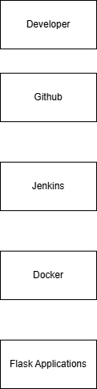
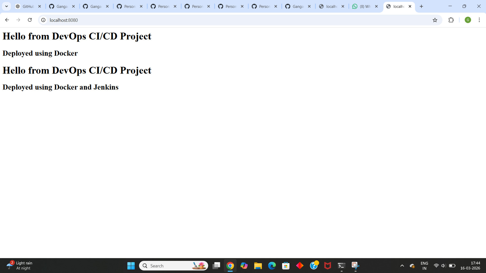

# Flask CI/CD DevOps Project

## Architecture Diagram

## Project Overview
This project demonstrates an end-to-end DevOps pipeline for deploying a Flask web application using Docker and Jenkins.

## Tools Used
- Linux
- Git
- Jenkins
- Docker
- Flask

## CI/CD Pipeline
Developer → GitHub → Jenkins → Docker → Flask Application

## How to Run

Build Docker image:

docker build -t flask-devops-app .

Run container:

docker run -p 5000:5000 flask-devops-app

Open browser:
http://localhost:5000# Flask CI/CD Pipeline Project

This project demonstrates a CI/CD pipeline using Jenkins, Docker, and Flask.

Technologies Used
- Python Flask
- Docker
- Jenkins
- Ubuntu
- GitHub

Pipeline Flow
Developer → GitHub → Jenkins → Docker Build → Container Run
## Architecture Diagram
## Project Structure

flask-cicd-project/
│
├── app.py
├── requirements.txt
├── Dockerfile
├── Jenkinsfile
├── architecture.png
├── screenshots/
└── README.md

## Jenkins Pipeline Stages

1. Developer pushes code to GitHub
2. Jenkins pulls the code
3. Docker image is built
4. Container runs the Flask application

## Application Screenshot

